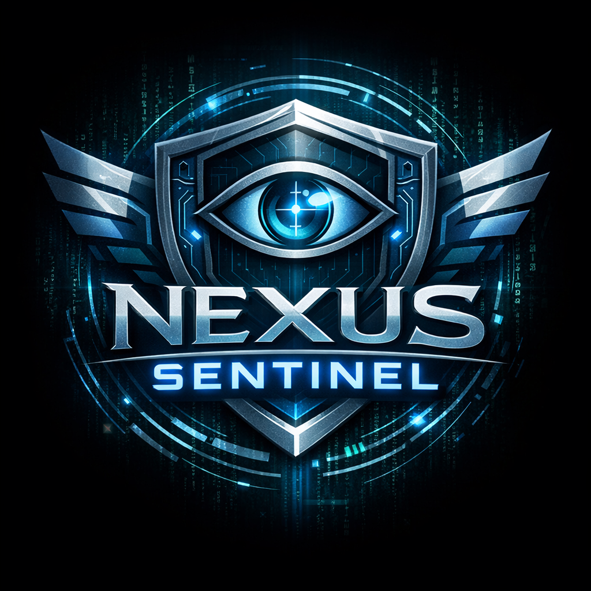

<p align="center">
  
</p>

<h1 align="center">Nexus Sentinel</h1>

<p align="center">
  <strong>Advanced System Introspection Framework for Windows</strong>
</p>

<p align="center">
  <a href="LICENSE">
    
  </a>
  
  
</p>

---

Nexus Sentinel is a unified platform for memory analysis, debugging, reverse engineering, and system monitoring. It combines the functionality of multiple specialized tools into a single, modern interface with support for multiple privilege levels.

## Features

### Core Capabilities
- **Memory Scanner** - Fast value searching with pointer scanning
- **Debugger** - Breakpoints, stepping, register and memory inspection
- **Disassembler** - x86/x64 instruction decoding and code analysis
- **Structure Dissector** - ReClass-style memory structure reverse engineering
- **Process Monitor** - API/syscall tracing, file and registry monitoring

### Technical Highlights
- Modern dark-themed WinForms UI with dockable panels
- C# scripting via Roslyn for automation
- Plugin system with signature verification
- Abstracted privilege layers (User Mode, Kernel, Hypervisor)
- Windows 10/11 x64 native

## Architecture

```
┌─────────────────────────────────────────────────────────────────┐
│                     Nexus UI (C# / .NET 10)                     │
│              Docking Shell │ Modules │ Plugins                  │
└─────────────────────────────┬───────────────────────────────────┘
                              │
┌─────────────────────────────▼───────────────────────────────────┐
│                    Abstraction Layer                            │
│    UserModeProvider │ KernelProvider │ HypervisorProvider       │
└──────────┬────────────────┬──────────────────┬──────────────────┘
           │                │                  │
┌──────────▼──────┐ ┌───────▼────────┐ ┌──────▼─────────┐
│  engine.dll     │ │ Sentinel.sys   │ │ SentinelHV     │
│  (Ring 3)       │ │ (Ring 0)       │ │ (Ring -1)      │
└─────────────────┘ └────────────────┘ └────────────────┘
```

## Building

### Requirements
- Visual Studio 2022 or later
- .NET 10 SDK
- CMake 3.20+ (for engine)
- Windows SDK 10.0.22621.0+

### Build UI
```bash
dotnet build Nexus/UI/Nexus.UI.csproj -c Release
```

### Build Engine
```bash
cd Nexus/Engine
cmake -B build -A x64
cmake --build build --config Release
```

## Usage

1. Run `Nexus.exe`
2. Select a target process via Process menu
3. Use the dockable panels to scan memory, set breakpoints, analyze structures, or monitor activity

## Use Cases

- Security research and malware analysis
- Game modding and reverse engineering
- Software debugging and diagnostics
- Educational purposes

## License

Nexus Sentinel uses a **dual-licensing model**:

### Open Source (AGPL v3)
The core application, UI, engine, and plugin SDK are licensed under the [GNU Affero General Public License v3](LICENSE).

### Commercial License
For proprietary integration without copyleft requirements, commercial licenses are available.

Contact: contact@nexus-sentinel.org or https://nexus-sentinel.org

## Contributing

Contributions are welcome. By submitting a pull request, you agree to the [Contributor License Agreement](CLA.md).

Please read the CLA before contributing - it allows us to maintain the dual-licensing model while keeping the core open source.

## Disclaimer

This software is provided for legitimate purposes including security research, malware analysis, software debugging, and educational use. Users are responsible for ensuring their use complies with applicable laws and terms of service.

## Links

- Website: https://nexus-sentinel.org
- Issues: [GitHub Issues](../../issues)
- Discussions: [GitHub Discussions](../../discussions)
